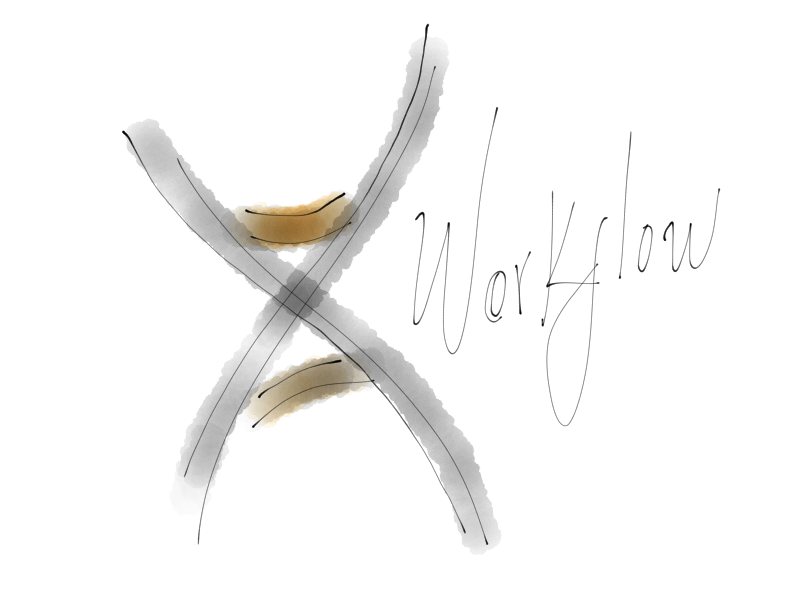

**Author:** Fernando Trasviña

**Revision**: Draft

# Introduction
Freshout has implemented and experimented with several methodologies in the past to improve its development process. It has been a long quest in the search of techniques, advancements, ideas and more, to better the way we work.
Even though the process has shown improvements here and there, there is no general consensus on what works and why. There is no manual or dedicated discussion time to improve and adopt these methodologies. Neither is there a feedback process to further advance and spread the knowledge from these practices to the rest of the company.
This document is the next step into these efforts.

# Objective
This document is meant to be a manual for an ongoing living and ever changing process for the entire company, where everyone can participate and collaborate with others to expose examples, special cases, prepare courses and discuss.

# General Process
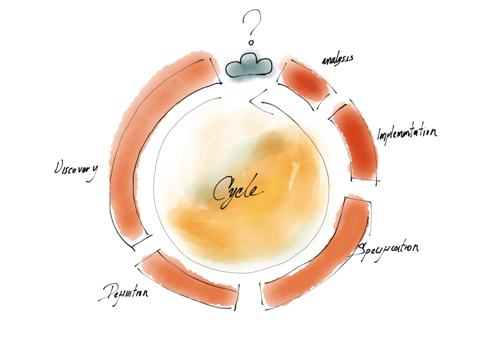
This General Process is the cycle in which we live while we work. Whether we are aware of it or not, we generally follow some form of this but in an unorganized way, which leads to errors and problems.

Following a constituted method reduces the number of errors. Even though the process may not be perfect, it represents a giant leap to success.

# How To Go Through The Process?
The main idea here is to look at the company as a single team. This means that even though you may not be included throughout the whole process, this is a single unit where some people take care of certain aspects, and you participate on your area of expertise in the overall process.

Moreover, there will be times where you will be in charge of a stage. In that case, knowing the entire process is helpful because you can participate on any stage and understand the value that others provide, as well as the value you provide.

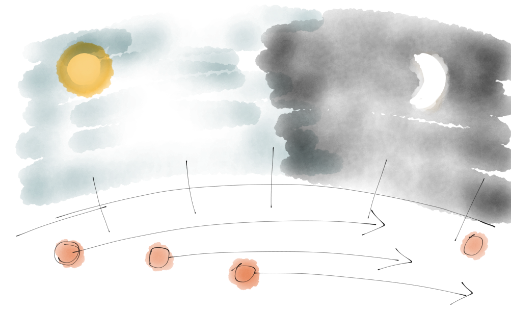

When you start working on a problem, the first thing to do is identify what its current stage is, and follow its process until the end. This may take several iterations, loops and tweaks, but you must follow through with the general process. It’s possible that you may need to hand your work over to another peer at some point so s/he can continue, or that someone may use your work as research in the future, so be sure to see it through.

A good analogy for this is trying to find your way out of an unknown forest. You may end up going in circles, making bad decisions, and may even be forced to go back, but if you execute a plan properly, you will get out of there with no harm. We tend to think that forcing our way out may work (and in some cases, it might), but that doesn’t mean that this is the right way to do it.

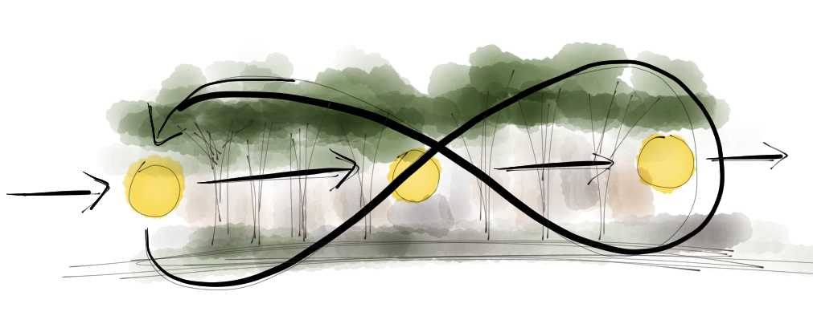
During the process you will need tools, and knowledge specific to each stage. It doesn’t matter if you don't have domain expertise because you will get better with practice and time. Just make sure that you don’t skip something because you don't fully get it, seems hard or useless. Instead, ask questions, read and research extra references. It’s better to do something partially right than not do anything at all.

# Problem Discovery
This first stage is where you get to observe something: the description of a new project, a customer describing a use case, a bug on the system, an undiscovered flow, a performance hit, or anything that draws your attention. This process is about discovering the components of the problem, their manifestations, and understanding their causes and effects.

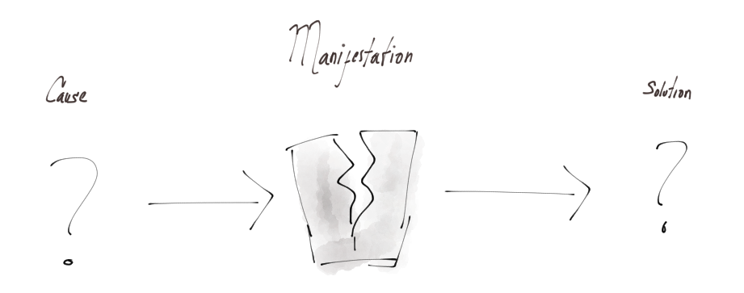

# Observation
Many problems occur in areas we don't fully understand. But even when you think you do know what they’re about, you should never take what you know for granted.

To be sure of what you’re dealing with, observe the system and try to understand it. List logs, reports, and data from other peers that could give you a clue on the system structure or flow.

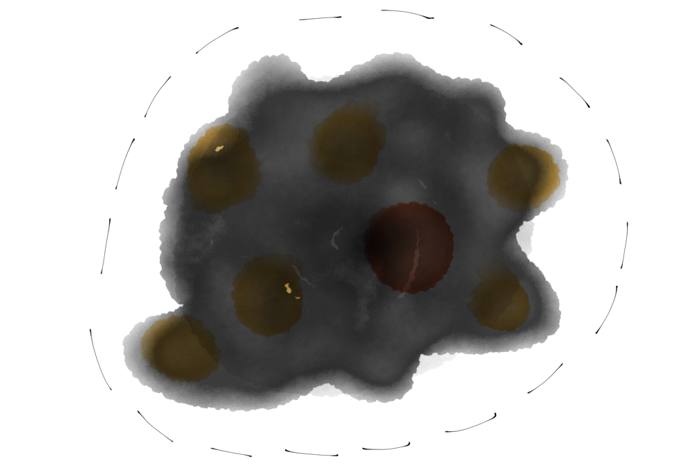


# Data Gathering
Gather all the data and look at it historically: when did the manifestation of the problem occur?, what was going on?, what variables on the system got modified?, is it just one or more?, etc. Try to think about logical and simple explanations, and look at the data you have to see if it matches.

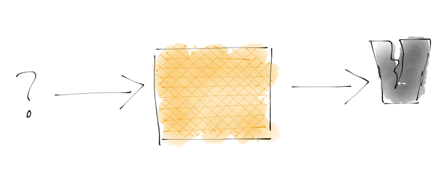

# Data Analysis
Once you get some ideas on the problem / system, use the data you have to prove the ideas wrong or right. Make sure to go through the data even if it’s a problem you think you’re 100% confident about. You may end up surprised and even inspired towards new discoveries.

On this stage, you should use visualizations, models, tools for analysis of text, logs, and all the resources you have at your disposal (even asking somebody or doing a fast internet search may help). Anything is valid as long as you understand the data and can test your ideas.

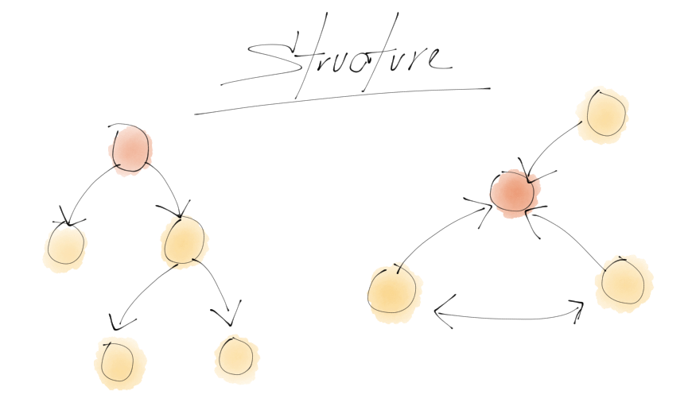

# Hypothesis Generation

Now you should be able to generate some ideas of your own. These ideas should be written down in a sentence that explains what is going on. The hypothesis may be wrong or right but this is not important at this point.

Taguchi diagrams are a very useful tool for this: they will give you an overview of your ideas and how those causes may be at play inside the system. The objective is to externalize and organize the ideas to prioritize them and find the right ones.

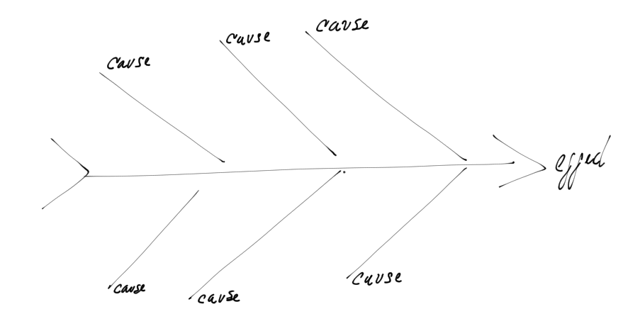
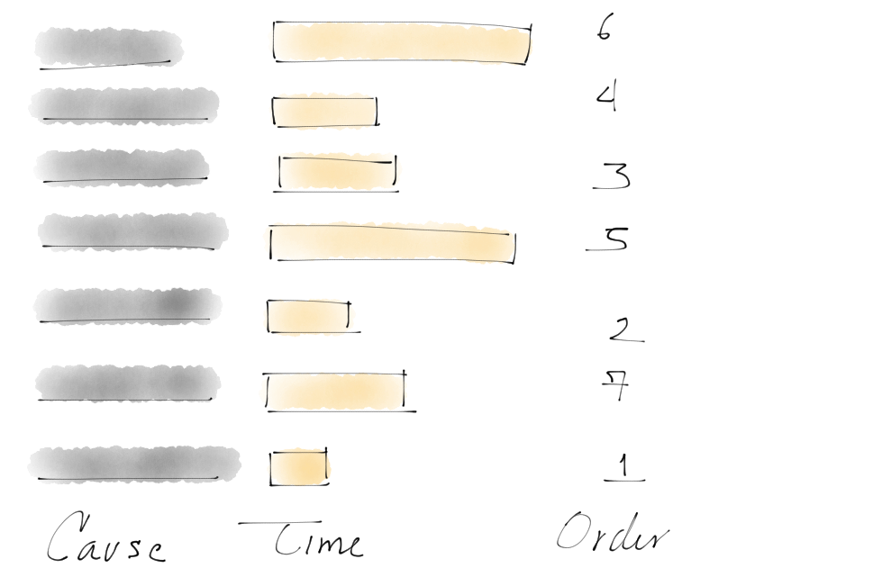

# Experimental Design

Experimental Design is a set of tools that aid in the process of knowledge generation and hypothesis testing. This is not TDD, but you may find some similar ideas.

Experimental Design is a methodology that helps you be efficient and allows you to have a high degree of reliability on the results you get. This procedure helps you test several ideas at the same time, and detect if you did something wrong along the way. It is a hard-to-master skill, but practice helps.

With it, you have to prove that the causes are important for the problem you’re working on. This is the foundation for the next stage, so don’t skip it!

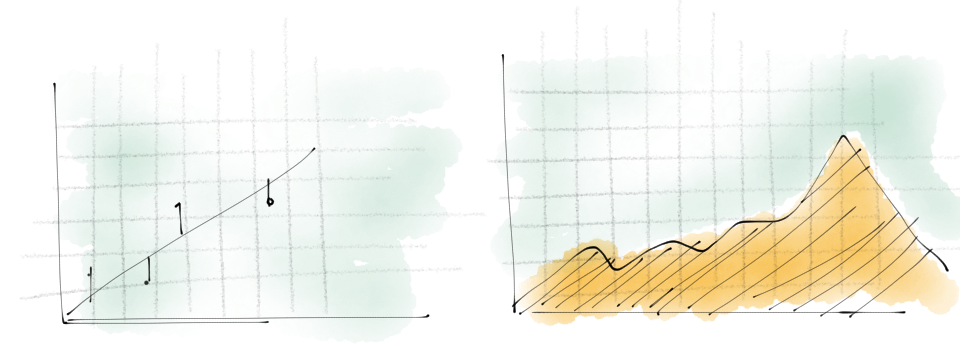

# Tests
These are a set of protocols that anyone can use to replicate your observations. They also work as your final tests to determine the success or failure of your hypothesis at the end of the process. Be sure to establish them in a clear manner because you will need them to continue.

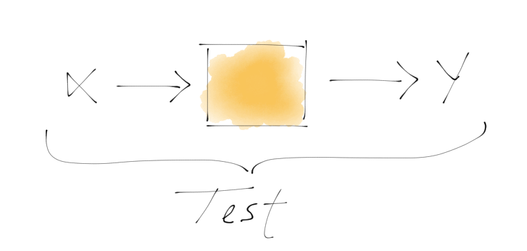

# Problem Definition
While you were working on the previous stages, you may have discovered that there is more than one problem going on. This is a common occurrence that shouldn’t be overlooked. If you try to force the problem to be only one and express it as such, you are taxing yourself with too much complexity. Define your problem in a single, simple sentence, but remember that there’s nothing wrong with having many definitions.

## Definition

The definition should be a single sentence that expresses the problem. Keep in mind that other people should be able to understand it, and if they want to know more about it, they should be able to look at your previous work to comprehend where it came from.

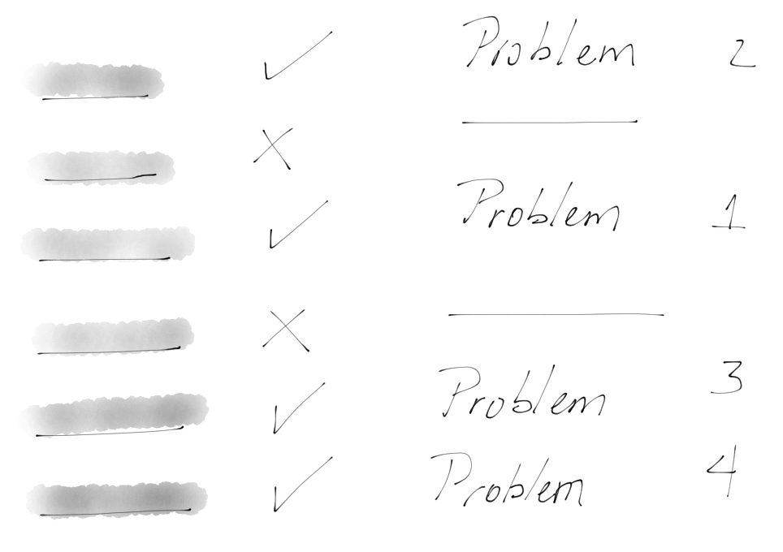

## Example:
Getting to 500 requests per second on this service increases the average response time from 10ms to 500ms. (good)
The service response time is affected by the number of requests per second (bad).

# Constraints
You should also define the constraints of the problem. There is no single system that behaves the same way, no matter the surrounding conditions, so make sure to list all the conditions and their importance. What may be a problem in a small computer may not be in a server.

# Search For Solutions
This stage is where the actual ideas are born. You may have started to develop some ideas in the previous stages, but this is where you need to document them. Gather with people, read, talk, draw, and generate some ideas on how you could solve the problem. Once you have that, it’s time to test those ideas to see if those are possible within the constraints.

# Research
Many problems have been solved already, and there is a chance your problem is one of them (though it might not be expressed the same way or in the same area). This is why it’s always a good idea to research and look around. If it hasn’t been solved, you may end up learning a few things that may have already worked or failed.

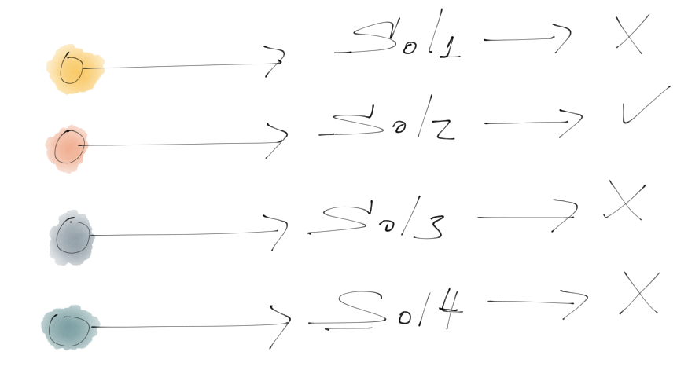

# Brainstorming
Now that you have a lot of information on the problem that you decided to solve, it’s time to gather some friends and talk about some solutions. Think about many possibilities, go crazy and be wrong! And don’t worry: there will be a chance to discard ideas that won’t work later on.

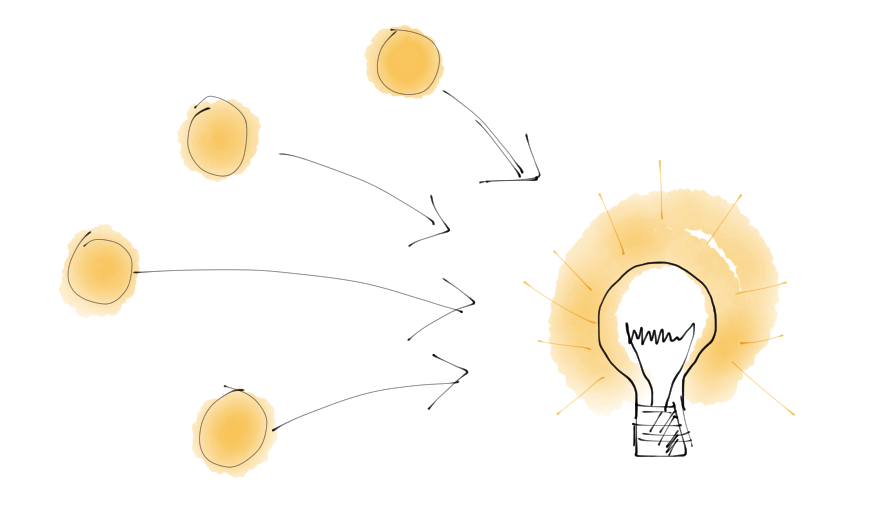

# Modeling

This step is about discarding weird ideas that may not work and choosing the best one that fits into the constraints. The diagrams, your old tests, and your documentation on the system will be key here to keep you focused.

Remember to discard everything that doesn’t work with the problem definition. Not only does this help improve the quality of your final solution, but it also reduces complexity.

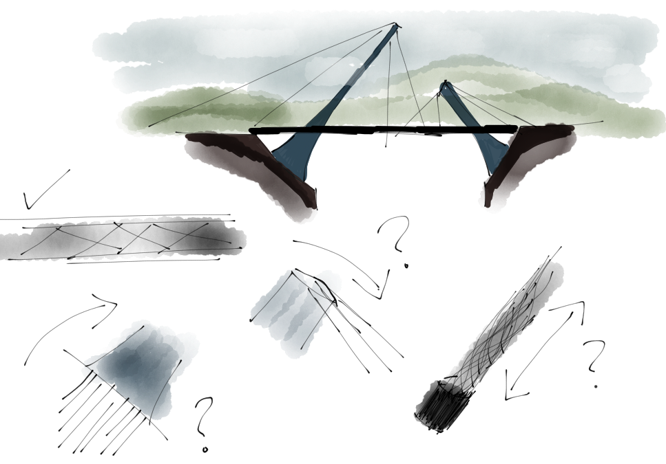

# Prototyping
You may believe that a prototype is a bad implementation of the solution but you shouldn’t think of it that way. On the contrary, a prototype is a simplified system that proves if the component can be built, and if it will work for the final solution.

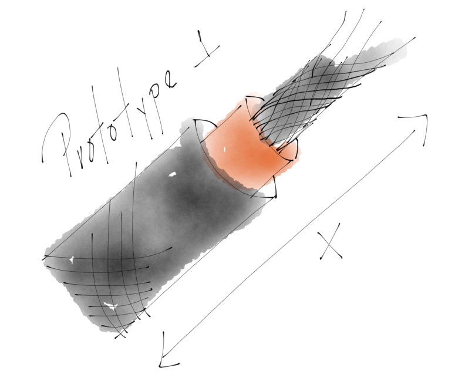

# Specification
The Specification is generally viewed by developers as the document that provides a solution to a problem, but this isn’t the case. The Specification is the guide with which you build the solution. It’s basically the result of all the previous work.

If you’re stuck in a part of the Specification, there is a high probability that you skipped or missed something in a previous stage, so go back and figure it out.

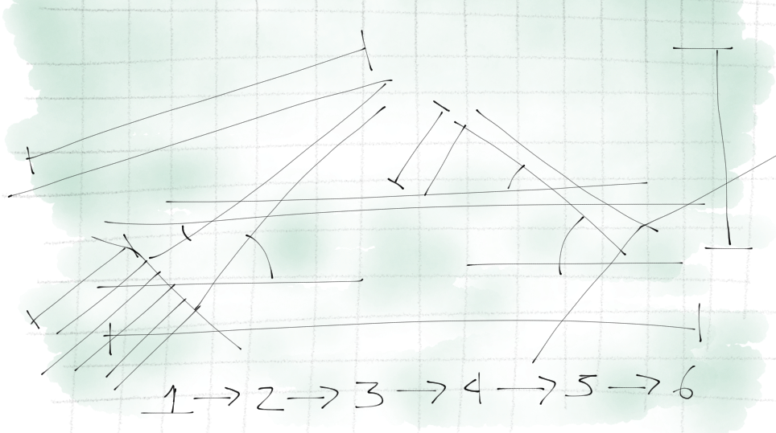

# Problem
This is where you establish the problem this “recipe” solves. Keep in mind that this is a SPECIFIC SOLUTION, meaning that it does not solve many problems, does not solve all the problems, does not build products, and it does not solve the problem and all its possibilities. Choose ONE problem and work on it.


# Background
This is the summary of the previous work done on this problem: research, failed attempts or improvements done by you or someone else. Be as clear as possible in this stage because this is how you will justify your course of action.


# Hypothesis
The Hypothesis is the foundation for your solution. It is a single sentence in which the solution is based. In some cases, it can be more than one sentence but keep it simple: it’s better to create more specs instead of trying to fit all into one.


# Solution Proposal
This is the general idea of the solution you came up with. It’s meant to be a small description of how the solution works. Using a “Black Box” diagram helps get the general picture of your solution and how it interacts with other components.

# Functional Specification
This is a detailed version of the solution proposal. Here you should be using diagrams, storyboards and text in an organized way that describes the different states, buttons or APIS on your solution. All the components and moving pieces of your solution should be specified. Think of this section as the anatomy of the solution.


# Technical Specification
This is the real deal. The Technical Specification is where you describe the steps to implement the solution with color codes, dimension sequences, algorithms, and protocols. Anyone following this part of the document should be able to implement the solution you created (assuming the right skills).

If you want to check how a specification is done, read about patents, RFC, IEEE, ECMA. These guys do specs for a living, so learn from them.

# Implementation
This is the stage where you stop being creative and become an execution machine. You have everything you need so now, it’s all about proper execution and error checking. Any change or strange situation should be written on your journal for later revision. All the tickets are consumed on this stage, and work gets distributed. This where things actually happen.



# Data Analysis
Now that you completed the implementation, check if you did it right. Testing your hypothesis is the first step you have to take. You already did this on the early stages of the specification and you also have the tests from the discovery stage. Those were the problems you were trying to solve, so check if you did.

Your constraints should have some kind of test too. Does it work on that old browser? Does it freeze on that slow network? Does the UX explains itself to a test user? Gather all that data because you will need it to build a report on what you achieved.

# Planning For The Future
Once you’ve finished all the work, it’s time to think it over. Document what you did, what you accomplished, what you failed to do, what new ideas you can think of, what other approaches could be tried, and even write up some improvements or new ventures that could be interesting.

This information will be valuable for you in the future, and it will change the way you move forward.

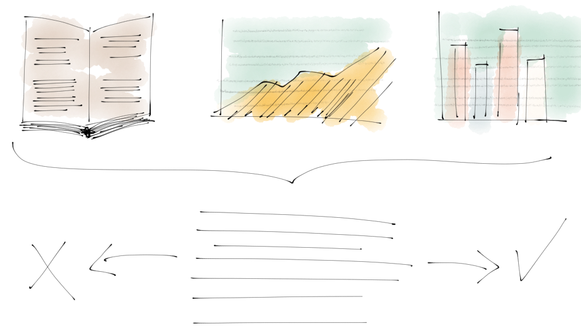

# Appendix References
1. [Research](http://en.wikipedia.org/wiki/Research)
1. [Problem solving](http://en.wikipedia.org/wiki/Problem_solving)
1. [Design thinking](http://en.wikipedia.org/wiki/Design_thinking)
1. [Scientific method](http://en.wikipedia.org/wiki/Scientific_method)
1. [Design of Experiments](http://en.wikipedia.org/wiki/Design_of_experiments)
1. Elio, Renee, and Peternela B Scharf. "Modeling novice-to-expert shifts in problem-solving strategy and knowledge organization." Cognitive Science 14.4 (1990): 579-639. [Modeling Novice-to-Expert Shifts in Problem-Solving Strategy and ...](http://onlinelibrary.wiley.com/doi/10.1207/s15516709cog1404_4/abstract)
1. Maarten Schraagen, Jan. "How experts solve a novel problem in experimental design." Cognitive Science 17.2 (1993): 285-309. [How Experts Solve a Novel Problem in Experimental Design](http://onlinelibrary.wiley.com/doi/10.1207/s15516709cog1702_4/abstract)
[Keeping a Research Journal](http://www.plantingscience.org/index.php?module=content&func=view&pid=74)

